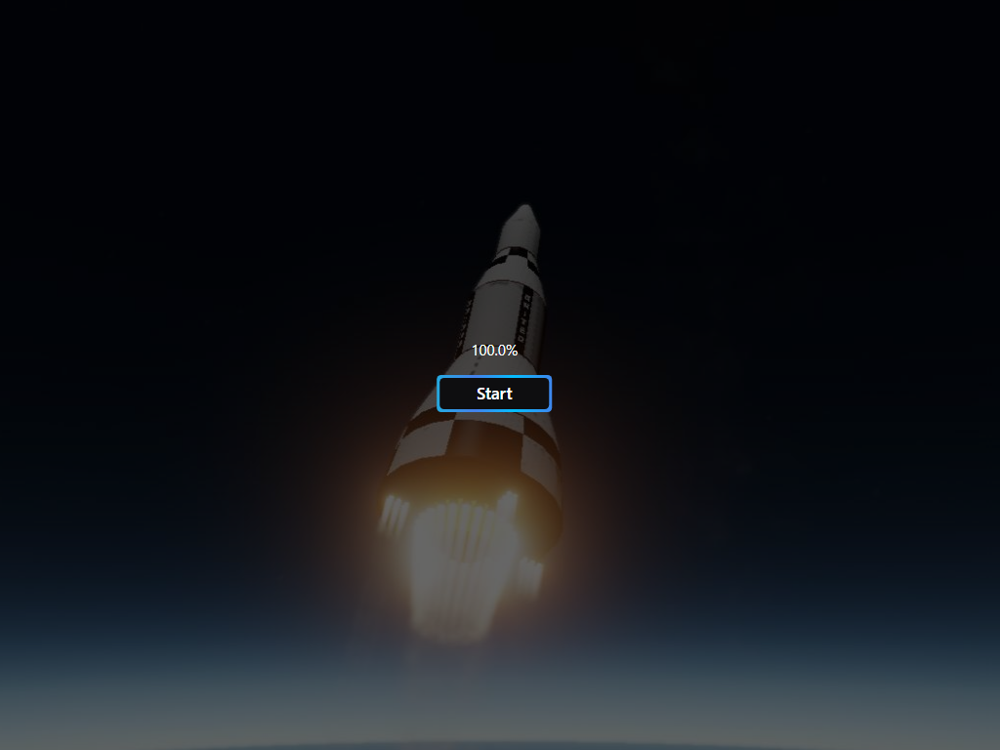

# 🚀 NASA_Nexus

### This website is an interactive website that displays a three-dimensional model of the Nexus rocket using the three.js technology. The website also provides comprehensive information about the Nexus rocket

## Link 🔗 [https://charactermi.github.io/nasa_nexus](https://charactermi.github.io/nasa_nexus)

 

# Preview

 

# Mobile Responsive

# Technologies

 

<ul>
    <li>
        
    </li>
    <li>
        
    </li>
    <li>
        
    </li>
    <li>
        
    </li>
    <li>
        
    </li>
    <li>
        
    </li>
    <li>
        
    </li>
</ul>
